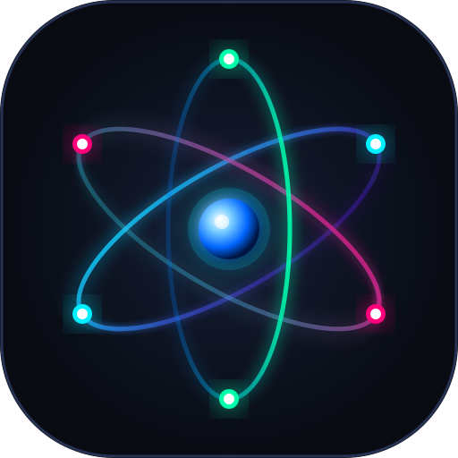

# Tabla Periódica 3D Interactiva ⚛️

Una aplicación web educativa y moderna para explorar los 118 elementos de la tabla periódica con modelos atómicos tridimensionales en tiempo real, órbitas cuánticas de Bohr, configuraciones electrónicas completas y propiedades físico-químicas.



## 🚀 Características Principales

- **Modelos Atómicos 3D Interactivos (Three.js)**:
  - Visualización del núcleo con protones ($p^+$) y neutrones ($n^0$).
  - Capas electrónicas animadas según el modelo de Bohr ($K, L, M, N, O, P, Q$) con velocidades orbitales relativas.
  - Controles 3D completos: rotación orbital táctil o con ratón, zoom suave, pausa/reanudación de giro automático y recentrado de cámara.
- **Modos de Color y Mapas de Calor**:
  - **Familia Química**: Metales alcalinos, alcalinotérreos, transición, no metales, halógenos, gases nobles, etc.
  - **Bloque Orbital**: $s, p, d, f$.
  - **Estado de la Materia (20 °C)**: Sólido, Líquido, Gas, Sintético.
  - **Mapa de Calor por Electronegatividad** (Escala Pauling 0.7 - 4.0).
  - **Mapa de Calor por Densidad** ($g/cm^3$).
  - **Mapa de Calor por Año de Descubrimiento** (Antigüedad hasta la era contemporánea).
- **Filtros Múltiples y Búsqueda en Tiempo Real**:
  - Búsqueda instantánea por nombre, símbolo, número atómico, familia o año.
  - Filtros rápidos por estado de agregación y bloques.
  - Indicador dinámico de elementos encontrados y botón de restablecimiento.
- **Fichas Técnicas Detalladas**:
  - Masa atómica, periodo, grupo, bloque.
  - Puntos de fusión y ebullición en Kelvin ($K$) y Celsius ($^\circ C$).
  - Medidor visual de electronegatividad.
  - Configuración electrónica completa y desglosada por capas.
  - Descripción histórica, científica y aplicaciones en el mundo real.
- **Deep Linking y Compartición**:
  - Cada elemento tiene su URL directa mediante Hash (ej: `#Au`, `#H`, `#79`).
  - Botón para copiar enlace directo al portapapeles con notificación toast.
- **Optimización SEO y Accesibilidad (a11y)**:
  - Metaetiquetas Open Graph y Twitter Cards completas.
  - Datos estructurados Schema.org (`WebApplication` y `EducationalApplication`) en formato JSON-LD.
  - `sitemap.xml`, `robots.txt` y `manifest.webmanifest`.
  - Icono SVG vectorial responsivo `favicon.svg`.
  - Atajos de teclado: `/` para buscar, `Esc` para cerrar, `←` `→` para navegar entre elementos, `Espacio` para pausar la rotación 3D.
  - Totalmente adaptativo (Mobile, Tablet, Desktop).

## 🛠️ Tecnologías

- **HTML5 Semántico**: Con marcado accesible y datos crawlables para motores de búsqueda.
- **CSS3 Moderno**: Variables CSS, glassmorphism (`backdrop-filter`), animaciones fluidas y diseño responsive.
- **JavaScript (ES6+)**: Lógica reactiva modular sin dependencias pesadas.
- **Three.js (r128)**: Renderizado 3D WebGL acelerado por hardware con iluminación y materiales dinámicos.
- **Google Fonts**: *Plus Jakarta Sans* y *JetBrains Mono*.

## 📖 Uso Local

Simplemente clona el repositorio y abre `index.html` en tu navegador favorito:

```bash
git clone https://github.com/mledpal/tabla-periodica.git
cd tabla-periodica
# Puedes abrir directamente index.html o usar un servidor local
npx serve .
```

## 📄 Licencia

Código abierto bajo licencia MIT.
