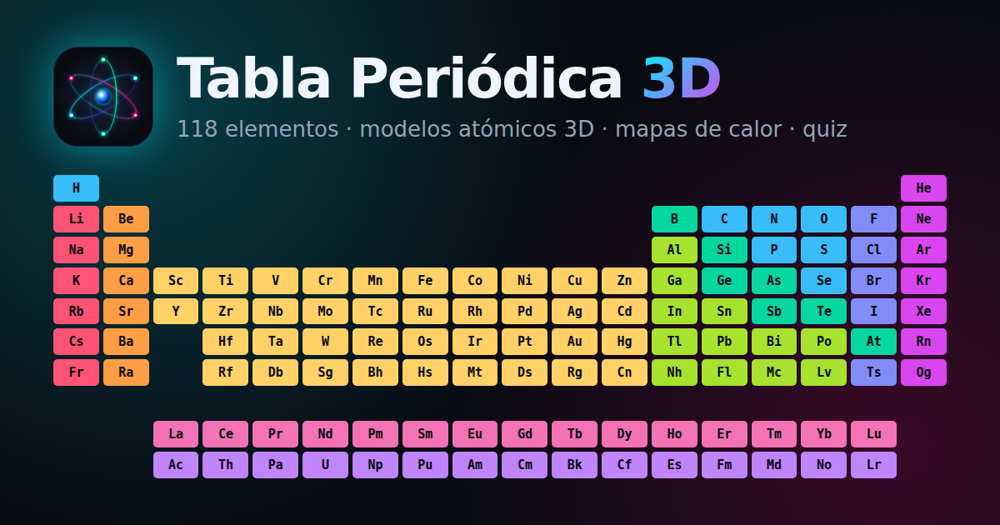

# Tabla Periódica 3D Interactiva ⚛️

Una aplicación web educativa y moderna para explorar los 118 elementos de la tabla periódica con modelos atómicos tridimensionales en tiempo real, órbitas de Bohr, configuraciones electrónicas completas y propiedades físico-químicas.



## 🚀 Características Principales

- **Modelos Atómicos 3D Interactivos (Three.js)**:
  - Núcleo con protones ($p^+$) y neutrones ($n^0$) y capas electrónicas animadas según el modelo de Bohr ($K, L, M, N, O, P, Q$).
  - Cada capa tiene su color y la capa de valencia aparece resaltada; fondo de estrellas y encuadre automático.
  - Rotación con ratón o táctil, zoom suave, pausa del giro automático y recentrado de cámara (`OrbitControls`).
  - Diagrama de Bohr en 2D si el navegador no admite WebGL.
- **Modos de Color y Mapas de Calor**:
  - Familia química, bloque orbital ($s, p, d, f$) y estado físico, cada uno con su leyenda pulsable para filtrar.
  - Mapas de calor de electronegatividad, densidad, masa atómica, punto de fusión, punto de ebullición y año de descubrimiento.
- **Temperatura Variable**: un deslizador de 0 a 6000 K recalcula en directo qué elementos son sólidos, líquidos o gases.
- **Filtros y Búsqueda en Tiempo Real**: por nombre (sin distinguir tildes), símbolo, número atómico, familia o año; filtros por estado y bloque.
- **Panel de Vista Previa**: al pasar el ratón o moverse con el teclado, el hueco central de la tabla muestra un resumen del elemento.
- **Fichas Técnicas Detalladas**: masa, periodo, grupo, densidad, electronegatividad, puntos de fusión y ebullición, estados de oxidación, electrones de valencia, configuración electrónica, descripción y enlace a Wikipedia.
- **Comparador**: elige hasta 3 elementos y compáralos en una tabla que marca el valor más alto y el más bajo.
- **Modo Quiz**: localiza elementos por nombre o número atómico; los filtros activos definen qué elementos entran en el juego.
- **Vista de Tabla o de Lista**: la lista se usa por defecto en móviles.
- **Tema Claro y Oscuro**: sigue la preferencia del sistema y se puede cambiar con un botón.
- **Deep Linking**: cada elemento tiene su URL (`#Au`, `#79`, `#oro`) y el botón Atrás del navegador cierra la ficha.
- **PWA**: instalable y usable sin conexión una vez visitada (service worker).
- **Accesibilidad (a11y)**:
  - Las celdas son botones navegables con las flechas del teclado, `Inicio` y `Fin`.
  - Foco gestionado en la ficha, contraste WCAG en todos los modos de color y soporte de `prefers-reduced-motion`.
  - Atajos: `/` para buscar, `Esc` para cerrar, `←` `→` para cambiar de elemento en la ficha, `Espacio` para pausar la rotación 3D.
- **SEO**: Open Graph y Twitter Cards con imagen, datos estructurados Schema.org en JSON-LD, `sitemap.xml` y `robots.txt`.

## 🛠️ Tecnologías

- **HTML5 Semántico** con marcado accesible y contenido indexable.
- **CSS3 Moderno**: variables CSS para los temas, glassmorphism (`backdrop-filter`), CSS Grid y animaciones.
- **JavaScript (ES6+)** sin frameworks ni paso de compilación.
- **Three.js (r170)** como módulo ES desde jsDelivr mediante un `importmap`; el visor se carga solo cuando se abre la primera ficha.
- **Google Fonts**: *Plus Jakarta Sans* y *JetBrains Mono*.

## 📁 Estructura

```
index.html            Página principal
css/style.css         Estilos y temas
js/data.js            Datos de los 118 elementos y utilidades
js/main.js            Interfaz: tabla, filtros, ficha, comparador, quiz
js/atom3d.js          Visor 3D (módulo ES, carga diferida)
sw.js                 Service worker (uso sin conexión)
img/                  Iconos PNG e imagen para redes sociales
```

## 📖 Uso Local

Clona el repositorio y sírvelo con cualquier servidor estático:

```bash
git clone https://github.com/mledpal/tabla-periodica.git
cd tabla-periodica
npx serve .
```

Si abres `index.html` directamente (`file://`), la tabla funciona, pero el navegador no permite cargar módulos ES desde disco: la ficha mostrará el diagrama de Bohr en 2D en lugar del modelo 3D.

## 📄 Licencia

Código abierto bajo licencia MIT.
